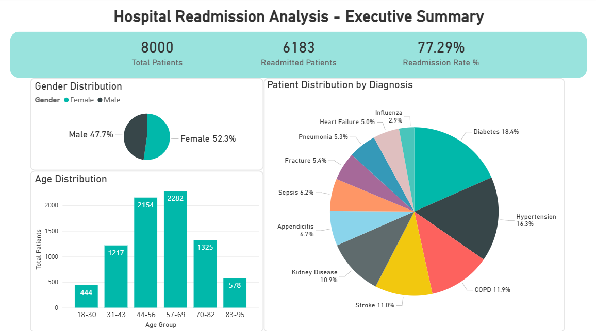
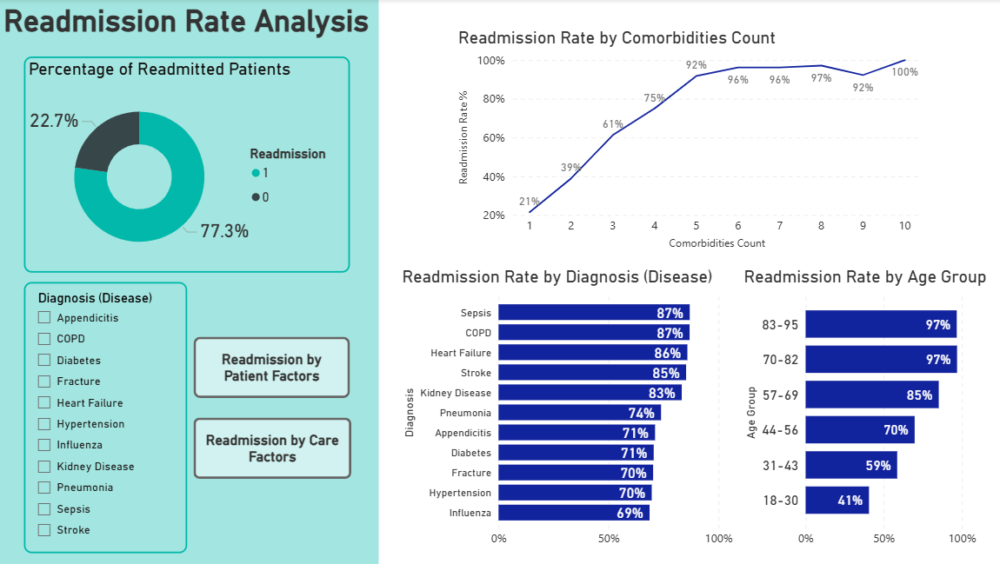
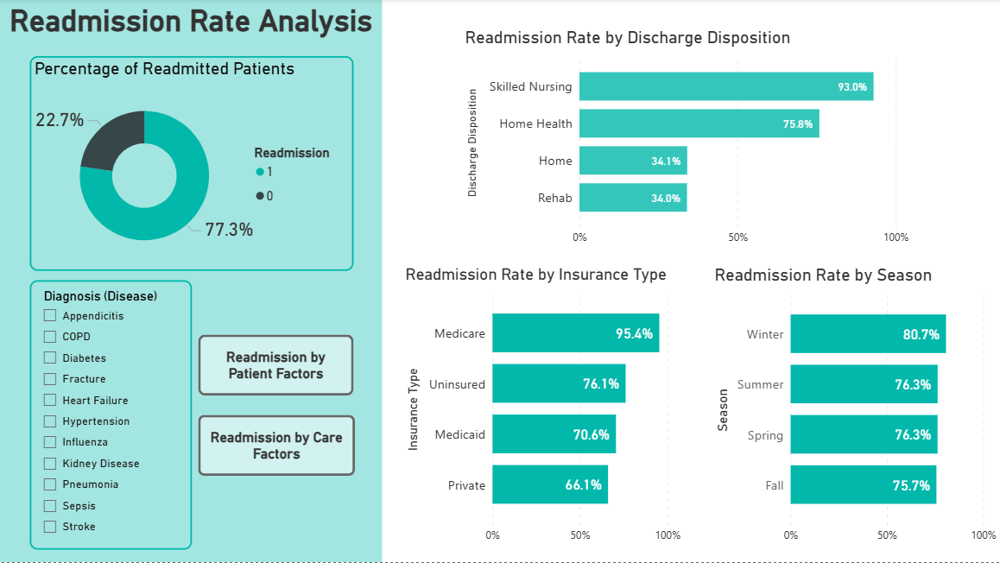
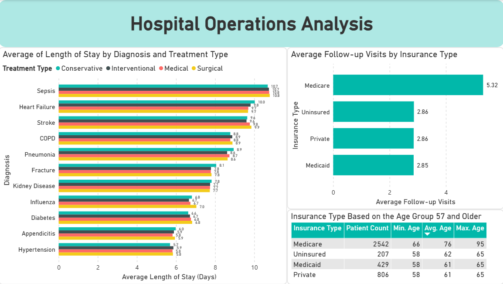
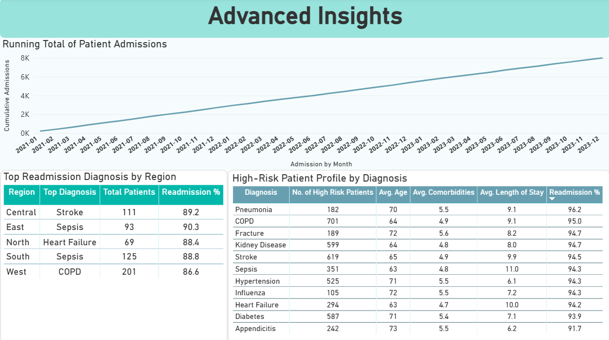

# 🏥 Hospital Readmission Analysis


End-to-end analysis of **8,000 patient records** to identify the clinical and operational drivers of hospital readmission. Built with **MySQL** for exploration and **Power BI** for visualization.

> 📌 **Dataset:** Synthetic data from [Kaggle — Hospital Patient Readmission Dataset](https://www.kaggle.com/datasets/mohamedasak/hospital-patient-readmission-dataset). Findings are illustrative of analytical approach, not real-world clinical conclusions.

---

## 📊 Dashboard Preview



---

## 🎯 TL;DR

- **77.3%** overall readmission rate across 8,000 patients
- Age and comorbidity load are the strongest drivers, readmission climbs from **41% in patients aged 18–30 to 97% in patients aged 70–82**
- **Skilled Nursing discharges** readmit at **93%**, vs. only 34% for home discharges (a gap most likely reflecting patient acuity, not facility quality)
- Medicare's high readmission rate (95%) is **age-driven, not insurance-driven**, validated through follow-up analysis
- A high-risk cohort of **4,394 patients** (risk score > 0.8) was identified, with 94% actual readmission, confirming the risk score is well-calibrated

---

## 🔍 Objective

Identify which patient and operational factors most strongly predict hospital readmission, and surface high-risk patient profiles that clinical and operational teams can act on.

---

## 🧩 Project Structure

```
hospital-readmission-analysis/
├── hospital_readmission_project.sql      # All SQL queries, organised by analysis section
├── hospital_readmission_project.pbix     # Power BI dashboard (5 pages)
├── hospital_readmission_dataset.csv      # Source dataset
└── screenshots/                          # Dashboard exports
    ├── 01_summary.png
    ├── 02_patient_factors_readmission.png
    ├── 03_care_factors_readmission.png
    ├── 04_operational_analysis.png
    └── 05_advanced_insights.png
```

---

## 📈 Key Findings

### 1. Patient Factors



- **Age is the strongest demographic driver.** Readmission climbs near-linearly with age: 41% (18–30) → 70% (44–56) → **97% (70–82).**
- **Comorbidity load compounds risk sharply.** Patients with 1 condition readmit at 21%; this jumps to **92% at 5 conditions** and ~96% at 6+.
- **Highest-risk diagnoses (each ≥85% readmission):** Sepsis (87%), COPD (87%), Heart Failure (86%), Stroke (85%).

### 2. Care Factors



- **Discharge destination matters more than expected.** Skilled Nursing discharges readmit at **93%**, vs. just 34% for patients discharged home.

  > ⚠️ **This gap should not be read as a quality-of-care issue with skilled nursing facilities.** Patients discharged to skilled nursing are typically sicker —managing severe chronic conditions that require constant monitoring— so the higher readmission rate most likely reflects underlying patient acuity, not nursing performance. Controlling for diagnosis and comorbidity count in a follow-up analysis would help isolate the true discharge effect.

- **Medicare shows 95% readmission**, the highest of any insurance type, but further analysis (below) confirms this is age-driven, not insurance-driven.
- **Seasonality is minimal:** Winter is slightly higher (81%) but the spread across seasons is under 5 points.

### 3. Operational Insights



- **Sepsis, Heart Failure, and Stroke** have the longest average lengths of stay (~10 days), regardless of treatment type.
- **Medicare patients average 5.3 follow-up visits per year**, nearly 2× other insurance types, consistent with an older, higher-acuity population.

### 4. Advanced Insights & High-Risk Profiles



- **High-risk cohort (risk score > 0.8):** 4,394 patients, 94% actual readmission rate, confirming the risk score's predictive value.
- **Top readmission diagnosis varies by region:** Sepsis (East, South), Stroke (Central), Heart Failure (North), COPD (West).

---

## 💡 Analytical Highlight: Hypothesis Validation

A surface-level reading of the data suggested Medicare was driving high readmission rates. Before reporting that as a finding, I tested whether it might actually reflect **age**, since Medicare primarily covers patients 65+.

```sql
SELECT
    insurance_type,
    COUNT(*) AS patient_count,
    MIN(age) AS min_age,
    ROUND(AVG(age), 0) AS avg_age,
    MAX(age) AS max_age
FROM hospital_data
GROUP BY insurance_type;
```

**Result:** Medicare's average age is **76**, vs. ~48 for other insurance types. The readmission gap is age-driven, not insurance-driven, a conclusion that changes how the finding should be acted on.

---

## ⚙️ Technical Highlight: CTE Refactor for Performance

While ranking patients above the average risk score *within their diagnosis group*, my first approach used correlated subqueries — readable, but slow on 8,000 rows.

```sql
-- Original approach: correlated subquery (slow)
SELECT patient_id, primary_diagnosis, readmission_risk_score,
    (SELECT AVG(readmission_risk_score)
     FROM hospital_data h2
     WHERE h2.primary_diagnosis = h1.primary_diagnosis) AS avg_for_diagnosis
FROM hospital_data h1
WHERE readmission_risk_score > (
    SELECT AVG(readmission_risk_score)
    FROM hospital_data h2
    WHERE h2.primary_diagnosis = h1.primary_diagnosis
);
```

I refactored this using a CTE to compute group averages **once**, then join — same output, much better performance:

```sql
WITH diagnosis_avg AS (
    SELECT primary_diagnosis, ROUND(AVG(readmission_risk_score), 2) AS avg_risk
    FROM hospital_data
    GROUP BY primary_diagnosis
)
SELECT h.patient_id, h.primary_diagnosis, h.readmission_risk_score,
       d.avg_risk AS avg_for_diagnosis
FROM hospital_data h
JOIN diagnosis_avg d ON h.primary_diagnosis = d.primary_diagnosis
WHERE h.readmission_risk_score > d.avg_risk
ORDER BY h.primary_diagnosis, h.readmission_risk_score DESC;
```

---

## 🛠️ Techniques Demonstrated

**SQL (MySQL)**
- Aggregations + conditional `CASE` for rate calculations
- Window functions: `RANK`, `DENSE_RANK`, partitioned averages, running totals
- CTEs for readability and performance optimization
- `STR_TO_DATE` parsing for monthly cohort analysis
- Hypothesis-driven follow-up queries to validate findings

**Power BI**
- Multi-page report design (5 pages) with consistent visual identity
- KPI cards, distribution charts, and ranked risk tables
- Cross-page navigation buttons for analytical flow
- Filter slicers for interactive diagnosis-level deep dives

---

## ⚠️ Limitations & Next Steps

- **Synthetic data.** The 77% overall readmission rate reflects dataset construction, not real-world rates (typically 15–20% in clinical settings). Patterns here illustrate analytical approach, not clinical reality.
- **Associations, not causes.** This analysis identifies correlations. Causal claims would require controlled study designs.
- **Future direction:** With real clinical data, the natural next steps would be:

  - 📈 **Survival analysis for time-to-readmission.** Move beyond the binary readmitted/not readmitted outcome to study *when* readmission happens, distinguishing early failures (care gaps) from late ones (disease progression). Methods: Kaplan-Meier, Cox regression.

  - 📊 **Logistic regression to quantify independent contribution.** Isolate each factor's effect while controlling for the others, untangling correlated variables like age, comorbidities, and insurance type.

  - 🎯 **Segment the high-risk cohort for targeted intervention.** Cluster the 4,394 high-risk patients into distinct profiles so operational teams can design targeted programs instead of one-size-fits-all workflows.

---

## 👩‍💻 Author

**Tesneem Fnais** — April 2026
